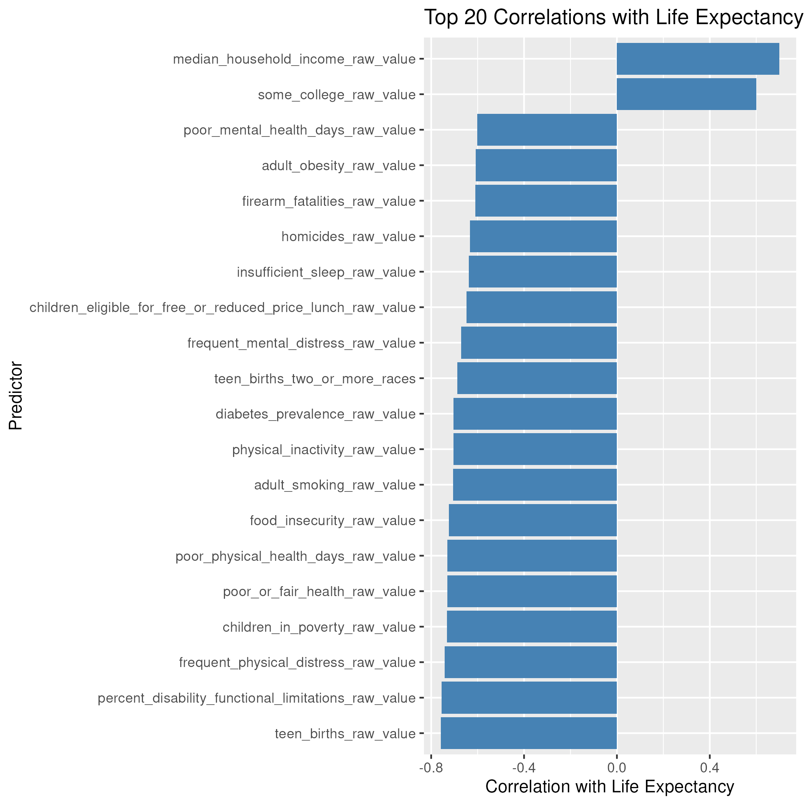
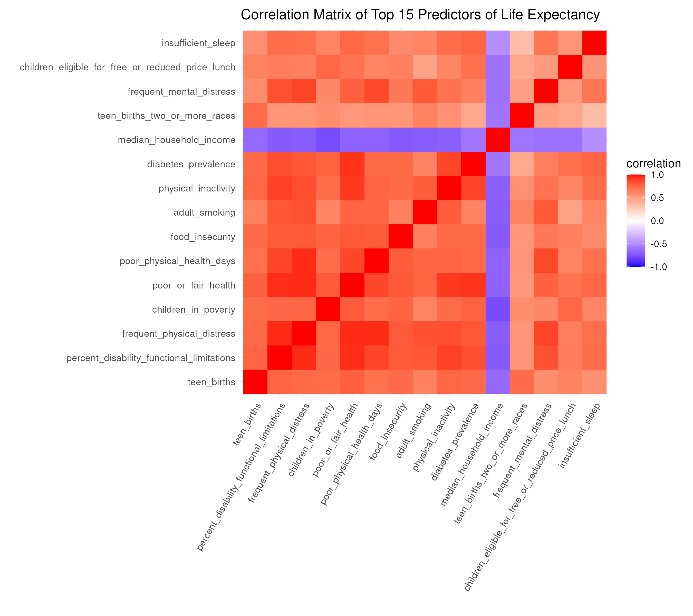
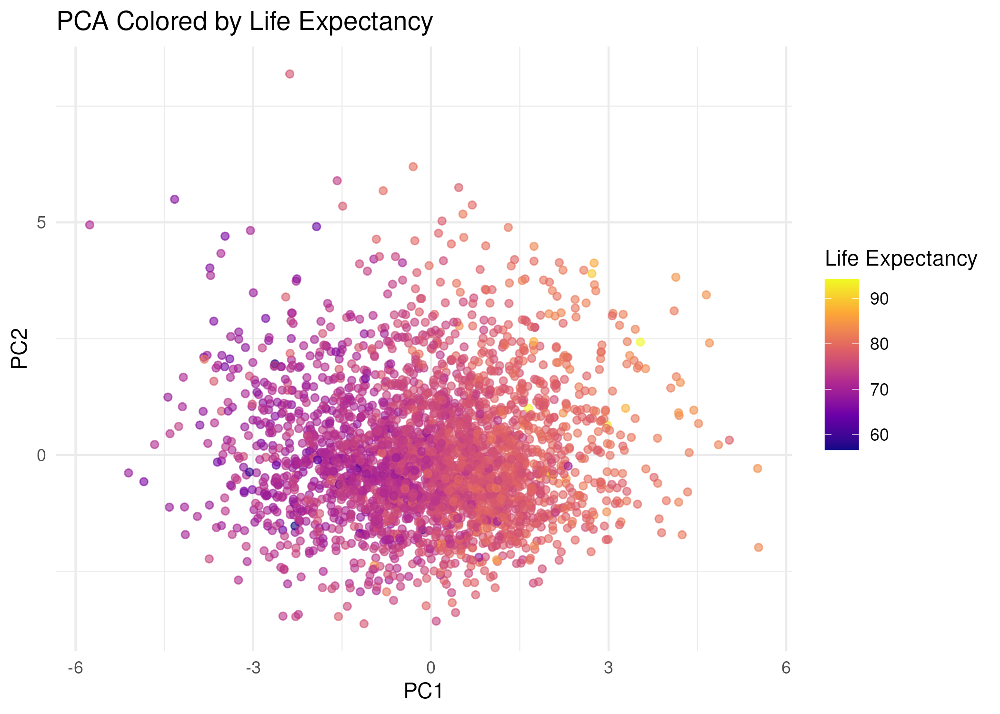
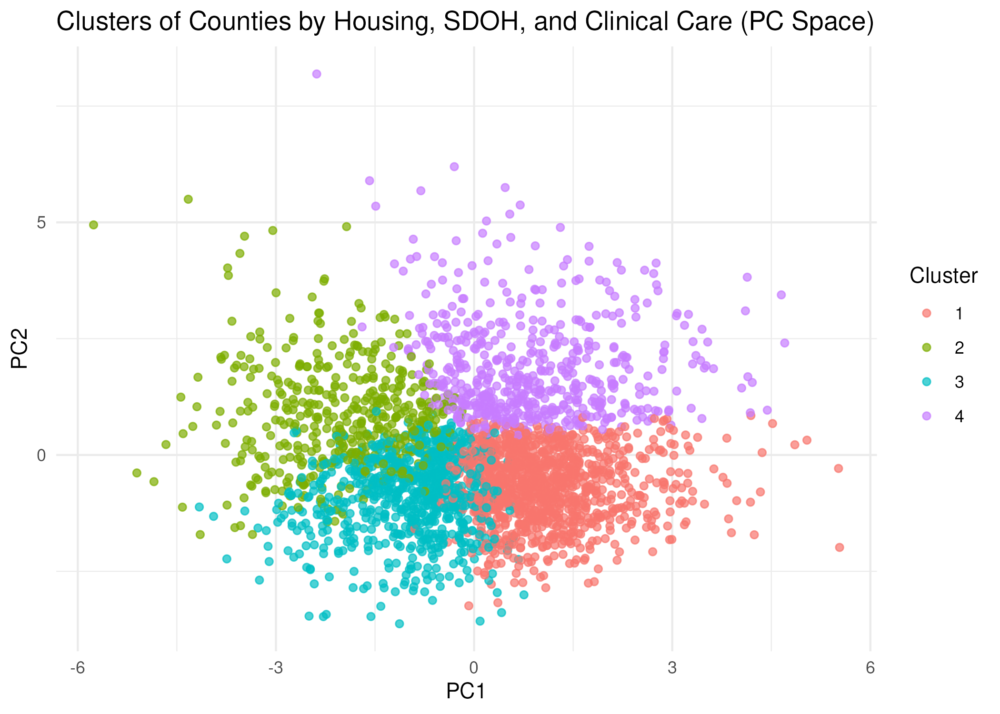
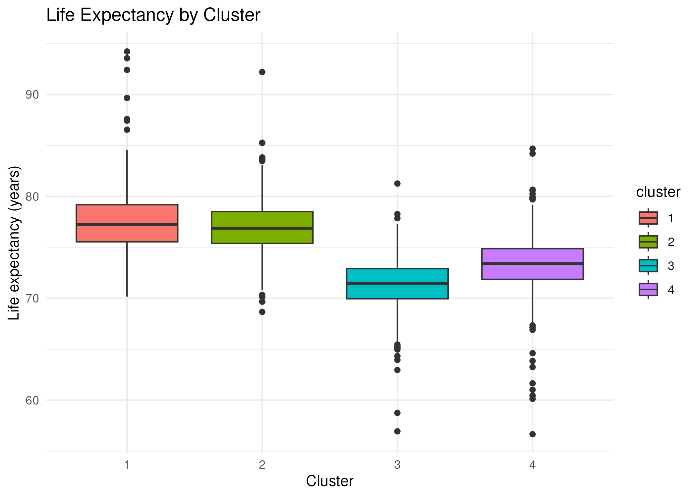
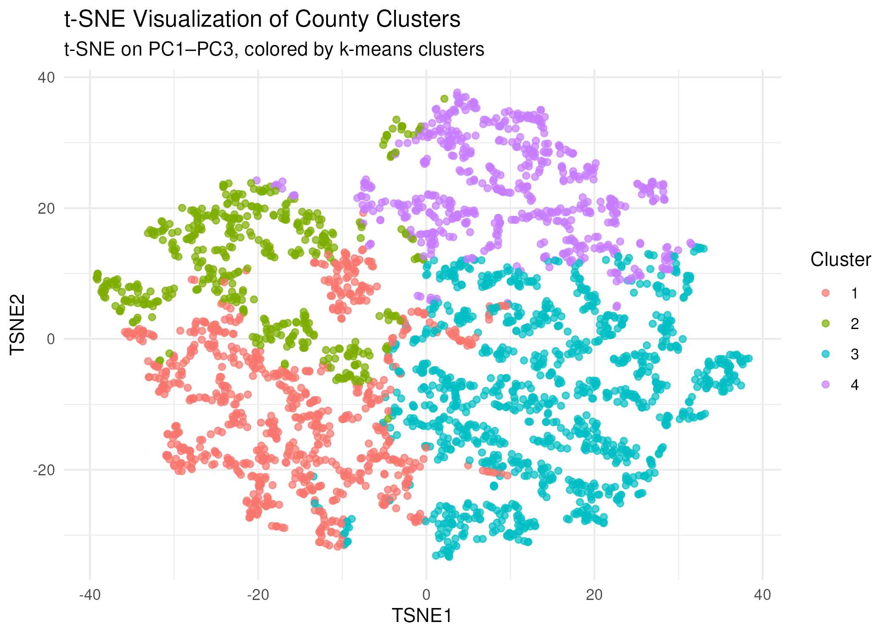
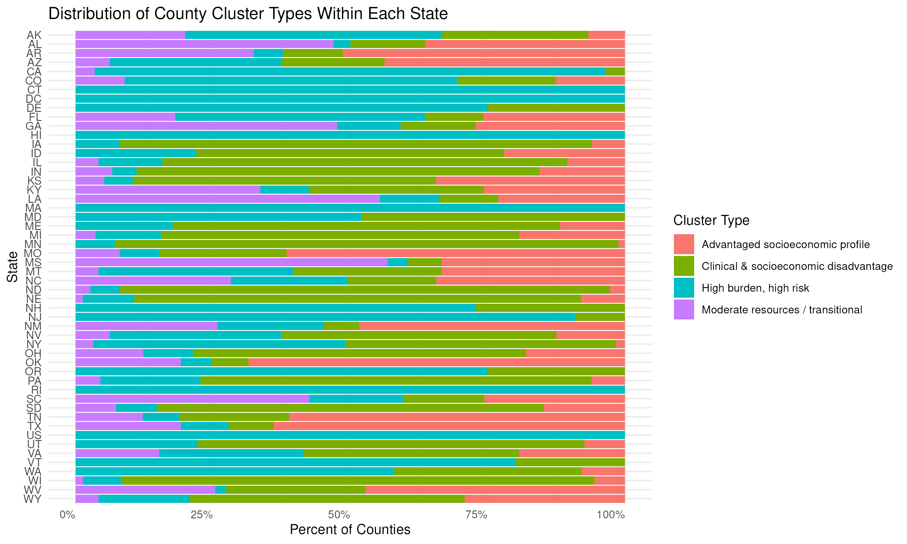

# The Data

This analysis uses data from the 2025 County Health Rankings and Roadmaps (CHR) dataset, a publicly available collection of population health indicators curated annually by the University of Wisconsin Population Health Institute. CHR compiles county-level measures representing social, economic, clinical, environmental, and behavioral determinants of health for all U.S. counties. These data are widely used by researchers, policymakers, and public health practitioners to assess community health needs and identify key drivers of population health outcomes.

The dataset is aggregated from numerous federal and national sources—including the CDC, CMS, U.S. Census Bureau, USDA, and Behavioral Risk Factor Surveillance System (BRFSS)—and undergoes methodological harmonization to ensure comparability across counties and years.

## Data Structure

The raw dataset contains

-   3,204 rows, representing U.S. counties, county equivalents, states, and aggregate national estimates.

-   796 variables, including

    -   **Raw values measures** (e.g., uninsured_raw_value)
    -   **Race/ethnicity-specific** estimates for many indicators (e.g., life_expectancy_black, mammography_screening_hispanic)
    -   FIPS codes and identifying metadata
    -   **Categorical and contextual indicators**, such as housing conditions, educational attainment, economic stability, health outcomes, and access to care.

## Measurement Domains Covered

County Health Rankings and Roadmaps organizes its measures across several conceptual domains: - **Health Outcomes**: life expectany, premature death, injury mortality, chronic disease burden. - **Health Behaviors**: smoking, physical inactivity, excessive drinking, sleep, drug overdose deaths. - **Clinical Care**: provider-to-population ratios, preventable hospitalizations, screening rates. - **Socioeconomic Factors**: income levels, education, unemployment, child poverty. - **Physical Environment**: housing burden, air quality, water system violations, commuting patterns. - **Demographics**: race/ethnicity composition, age distribution, rural/urban status, population size.

### Relevance of this Dataset to this Project

Life expectancy serves as the primary health outcome of interest. A subset of predictors relevant to social determinants of health and clinical care access were selected from the full dataset, including: - Housing burden indicators - Income and poverty measures - Insurance Rates - Ratio of population to primary care physicians - Preventable hospital stay rates These measures relfect structural and resource-based factors that plausibly shape population health.

# Methods and Results

## Data Preparation

The 2025 County Health Rankings dataset contains 3,204 counties and 796 variables spanning demographics, social determinants, health outcomes, and clinical care access. Because nearly all fields import as character strings, preprocessing focused on converting numeric-like values to numeric, recoding placeholders such as "Not Available" to missing, and removing non-analytic fields such as FIPS identifiers, race-specific estimates, confidence intervals, and numerator/denominator components.

A subset of seven predictors was selected based on completeness and theoretical relevance to life expectancy: housing cost burden (two measures), median household income, child poverty, uninsurance rate, primary care provider access, and preventable hospital stays. Life expectancy was used as the outcome. All predictor variables were standardized prior to analysis.

## Exploratory/Correlation Analysis

Pearson correlations were calculated between each predictor and life expectancy. Higher income and lower poverty exhibited strong positive correlations with life expectancy, while housing burden, insurance, and preventable hospitalizations showed negative correlations. Several predictors were strongly correlated with one another, indicating multicollinearity.





The set of strongest associations shows that life expectancy is heavily shaped by socioeconomic and access-related factors, many of which are themselves correlated. The heatmap reinforces this by revealing clusters of variables that move together—for example, poverty, uninsured rate, and preventable hospitalizations forming a tightly linked group. This level of multicollinearity makes it difficult to treat predictors independently and suggests that counties differ along a few underlying dimensions rather than dozens of separate variables.

To address this, I used principal components analysis (PCA) to reduce the correlated predictors into a smaller number of uncorrelated components that capture the dominant socioeconomic and clinical care patterns across counties. These components then served as the input for clustering, allowing us to group counties based on shared structural characteristics rather than individual, redundant variables.

## Principal Components Analysis

PCA was performed on the scaled predictor matrix to identify latent dimensions underlying socioeconomic and clinical characteristics of U.S. counties. Together, the first three principal components explained the majority of the variance in the predictor set, making them suitable for subsequent clustering.

```{r setup-data, message=FALSE, warning=FALSE}
# load packages
library(tidyverse)
library(cluster)
library(factoextra)

# load data
chr_clean <- read_csv("derived_data/chr_clean_full.csv")

# predictor set
pred_vars <- c(
  "percentage_of_households_with_high_housing_costs",
  "severe_housing_cost_burden_raw_value",
  "median_household_income_raw_value",
  "children_in_poverty_raw_value",
  "uninsured_raw_value",
  "ratio_of_population_to_primary_care_physicians",
  "preventable_hospital_stays_raw_value"
)

# prepare PCA data
pca_dat <- chr_clean |>
  select(life_expectancy_raw_value, all_of(pred_vars)) |>
  drop_na()

X <- pca_dat |> select(all_of(pred_vars))

# run PCA
pc_res <- prcomp(X, center = TRUE, scale. = TRUE)

# PCA scores
pcs <- as_tibble(pc_res$x) |>
  mutate(life_expectancy_raw_value = pca_dat$life_expectancy_raw_value)
```



## K-Means 

Clustering To identify groups of counties with similar structural profiles, k-means clustering was performed on the first three principal components. Using the Gap Statistic to assess cluster fit across k = 1–10, the optimal number of clusters was estimated near k = 4, balancing interpretability and within-cluster cohesion. Although the gap curve suggested diminishing returns past k = 1, visual interpretability and separation of PC-space regions supported the selection of four clusters.

```{r}
plot(pc_res, type = "l", main = "Scree Plot")
```

```{r}
pc_for_cluster <- pcs |> select(PC1:PC3)
gap <- clusGap(pc_for_cluster, FUN = kmeans, K.max = 10, B = 50)
plot(gap)

```

### Principal Component-Based Clustering

After determining a reasonably interpretable number of clusters (k = 4), k-means clustering was applied to the first three principal components. The resulting clusters reflect distinct combinations of socioeconomic conditions, health care access, and clinical burden. 

 

This PCA scatterplot shows how counties group into four distinct regions of principal component space, representing different combinations of housing burden, poverty, clinical care access, and preventable hospitalizations. Counties form four partially separable groupings in PC1–PC2 space, suggesting meaningful structural differences. Clusters are not perfectly separable — as expected in social science data — but each cluster occupies a characteristic region of the PCA landscape. For example, Cluster 1 tends to lie in higher PC1/lower PC2 values (indicative of higher income and lower poverty), whereas Clusters 3 and 4 lie toward the negative end of PC1, consistent with greater socioeconomic disadvantage.

To assess whether these structural clusters correspond to meaningful population health differences, life expectancy was compared across clusters.



Clusters varied meaningfully in life expectancy. Cluster 1 had the highest median life expectancy, followed closely by Cluster 2. Clusters 3 and 4 exhibited noticeably lower life expectancy, with Cluster 3 representing the most disadvantaged conditions. These differences align closely with the socioeconomic and clinical care patterns reflected in the PCA loadings. This indicates that counties with similar structural conditions also share similar population health outcomes — validating that the clustering captures meaningful variation rather than noise.

## t-SNE

While PCA provides a linear projection of the data, many socioeconomic and clinical-care variables exhibit nonlinear relationships. To supplement the PCA visualization, t-distributed stochastic neighbor embedding (t-SNE) was applied to highlight local structure and reveal whether clusters formed by k-means remain cohesive in a nonlinear embedding space.

t-SNE was run on the first three principal components (PC1–PC3). Using PCs rather than raw variables improves stability by reducing noise and mitigating the impact of multicollinearity. The perplexity parameter was tuned within standard ranges for a dataset of this size (perplexity 30 was used), and results were visually stable across multiple random seeds. Because t-SNE is not a clustering algorithm but a visualization tool, k-means assignments from PCA space were overlaid onto the t-SNE map to evaluate whether clusters remain coherent under nonlinear projection



The t-SNE embedding reveals clear nonlinear separation between the four clusters identified in k-means. Unlike PCA—where clusters overlapped because PCA captures only linear variance—t-SNE preserves local structure and uncovers how counties naturally group based on shared socioeconomic and clinical-care profiles. .

-   **Cluster 1** (red) forms a distinct group in the upper-right, representing counties with stronger socioeconomic conditions: higher income, lower housing burden, and better access to care.
-   **Cluster 2** (green) spans the upper-left and center, indicating counties with moderate resources and mixed housing and poverty levels.
-   **Cluster 3** (blue) occupies the lower-right, representing areas with higher preventable hospitalizations, poorer clinical access, and lower life expectancy.
-   **Cluster 4** (purple) clusters in the lower-left, reflecting counties with substantial socioeconomic disadvantage and high housing burden.

These nonlinear patterns reinforce that the clusters reflect meaningful, real-world structural differences, not artifacts of PCA or random grouping. The gradient from the upper-right (best conditions) to lower-left (worst conditions) mirrors life expectancy variation, supporting the validity of the clustering results. The strong agreement between PCA-space clusters and t-SNE neighborhoods further validates that the clustering solution captures meaningful, robust county groupings

### Cluster Distribution Across States

After assigning each county to one of the four structural cluster types, I examined how these clusters were distributed across states. This provides a high-level view of how socioeconomic conditions, health care access, and structural resources vary geographically.

The figure below displays, for each state, the percentage of counties falling into each cluster category. Percentages are normalized within states, so each bar sums to 100%.

Overall, states showed substantial variation in their county compositions. Some states—particularly in the Midwest and Mountain West—contained mostly advantaged or mixed-resource counties, whereas states in the South tended to have higher proportions of counties classified as disadvantaged or high-burden. These patterns align with long-documented regional disparities in poverty, clinical access, and chronic disease burden.

This distribution analysis is not intended as a full geographic deep dive but rather as a descriptive extension of the clustering results, illustrating how structural health patterns manifest across U.S. states.

 

#Next Steps and Opportunities for Further Analysis 
This project provides an initial exploration of how socioeconomic and clinical-care indicators cluster across U.S. counties and how these structural patterns relate to life expectancy. Several useful extensions could deepen this work:

1.  Incorporate Additional Predictors

Future analyses could integrate environmental exposures, health behaviors, or more granular workforce measures to refine cluster definitions.

2.  Assess Cluster Stability

Methods such as bootstrapping or silhouette analysis could evaluate how robust these clusters are to changes in variable selection or scaling.

3.  Map Clusters Geographically

Spatial visualization would show how clusters align with regional patterns, rural-urban gradients, or state policy environments.

4.  Model Life Expectancy Directly

A regression or machine-learning model could quantify how much variance in life expectancy is explained by the cluster-defining predictors.

5.  Compare Clusters Over Time

Using CHR data from multiple years would help assess whether counties transition between structural profiles or remain stable.
